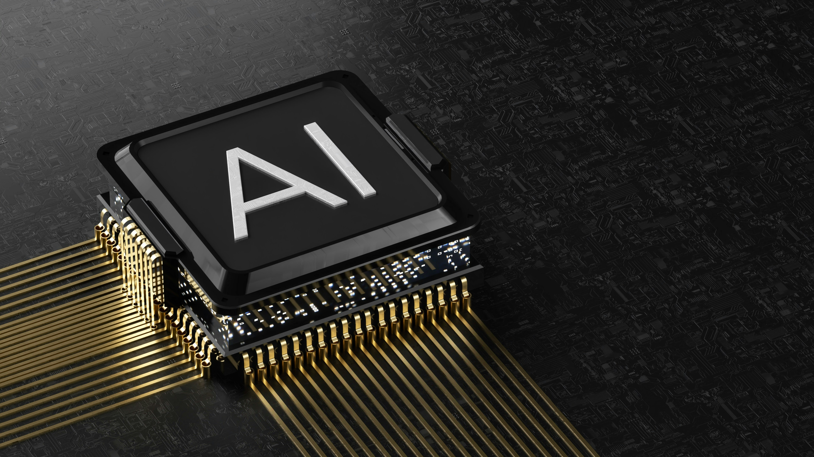

# 🧠 Summary: The Evolution of Artificial Intelligence:

## Foundations (1940s–1950s):
- Early thinkers like Alan Turing, John von Neumann, and Claude Shannon built the theoretical and mathematical groundwork for AI.
- Neural network concepts and the Turing Test emerged.

## Birth of AI (1956)
- The Dartmouth Conference officially launched the field of Artificial Intelligence.
- Early optimism inspired foundational programs like Logic Theorist and ELIZA.

## AI Winters (1970s–1980s):
- Progress slowed due to limited computing power and overhyped expectations, leading to reduced funding and research.
- Machine Learning Era (1990s–2010s)
- Shift from symbolic reasoning to data-driven learning.
- Algorithms like SVMs and neural networks gained traction.
- Major milestone: Deep Blue defeated Garry Kasparov (1997).

## Deep Learning Revolution (2010s–2020s):
- Breakthroughs with CNNs, RNNs, and Transformers.
- Landmark moments: AlphaGo (2016), BERT (2018), GPT-3 (2020).

## Generative AI Era (2022–Present):
- Rise of systems like ChatGPT, Claude, Gemini, and Stable Diffusion.
- AI became creative, multi-modal, and widely accessible.

## Agentic AI (2024–Future):
- AI evolves into autonomous, goal-driven agents capable of reasoning, planning, and executing tasks.
- Examples: AutoGPT, Devin, and GPT agents.

## How LLMs Work:
- Core idea: LLMs predict the next word (token) in a sequence, learning language patterns from massive text datasets.
- Architecture: Built on the Transformer (2017), which uses self-attention to model relationships between all words simultaneously.

## Training process:
Pretraining on large text corpora to learn general language knowledge.
Fine-tuning and RLHF (Reinforcement Learning from Human Feedback) to align responses with human intent.

## Major Breakthroughs Enabling Modern LLMs:
1. Transformer architecture – Enabled parallel processing and long-range context understanding.
2. Scaling laws – Showed performance improves predictably with more data, parameters, and compute.
3. Massive compute infrastructure – GPUs, TPUs, and distributed training allowed billion-parameter models.
4. High-quality datasets – Curated, large-scale text data improved generalization and safety.
5. RLHF – Made models more aligned, helpful, and safe for human interaction.
6. Efficient training techniques – Mixed precision, better optimizers, and new tokenization methods improved speed and scalability.

## Summary Timeline of Paradigm Shifts:

| Era           | Paradigm Shift                          | Key Milestones                          |
|---------------|----------------------------------------|----------------------------------------|
| 1940s–50s     | Logic-based AI                           | Turing Test, early neural concepts      |
| 1956–1970s    | Symbolic reasoning                       | Logic Theorist, ELIZA, expert systems  |
| 1980s–1990s   | Rule-based → data-driven                 | Backprop, Deep Blue                     |
| 2006–2012     | Feature engineering → representation learning | AlexNet, deep CNNs                    |
| 2017–2020s    | Task-specific → foundation models        | Transformers, BERT, GPT                 |
| 2022–Present  | Narrow → multimodal, generative AI       | ChatGPT, Stable Diffusion               |
| 2024–Future   | Autonomous & agentic AI                  | AutoGPT, goal-driven agents             |
